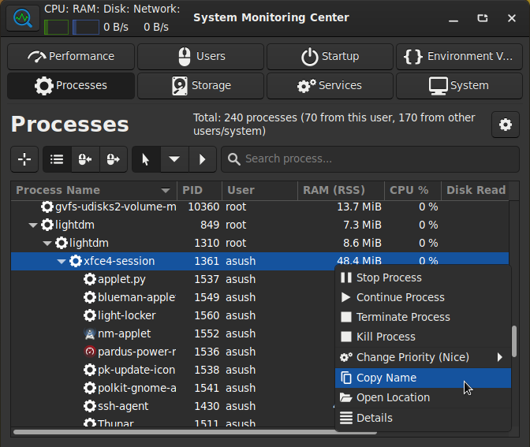
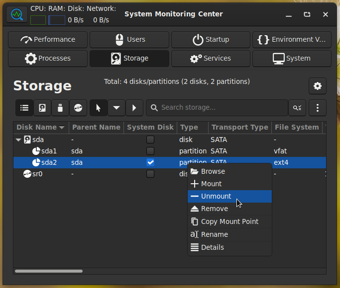
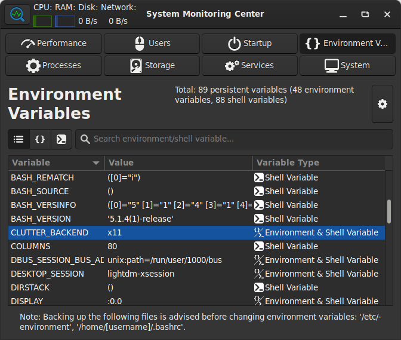

# System Monitoring Center

GTK3 and Python 3 based, system performance and usage monitoring tool.

</a>

</a>

</a>

</a>

</a>

### Features:
* Detailed system performance and usage usage monitoring/managing features:
    * Monitoring CPU, RAM, Disk, Network, GPU, Sensor hardware information/performance/usage
    * An always on top and semi-transparent floating summary window for performance monitoring
    * Monitoring and managing processes, users, storage devices, startup applications, services (systemd) and environment variables
    * Monitoring general system information
* Customization options per-tab
* Low system resource usage while monitoring
* Language support (more languages will be added if translations are provided by contributors):
    * English, Turkish
* Provides help information when mouse hover action is performed on several GUI objects
* Adapts to system theme
* Free and open sourced

### Dependencies:
* Python 3 (Programming language)
* GTK3 (GUI)
* python3-opengl (for FPS counting)
* Pycairo (for graphics)

### Status:
* The application is in Beta stage and there may be bugs to be fixed.
