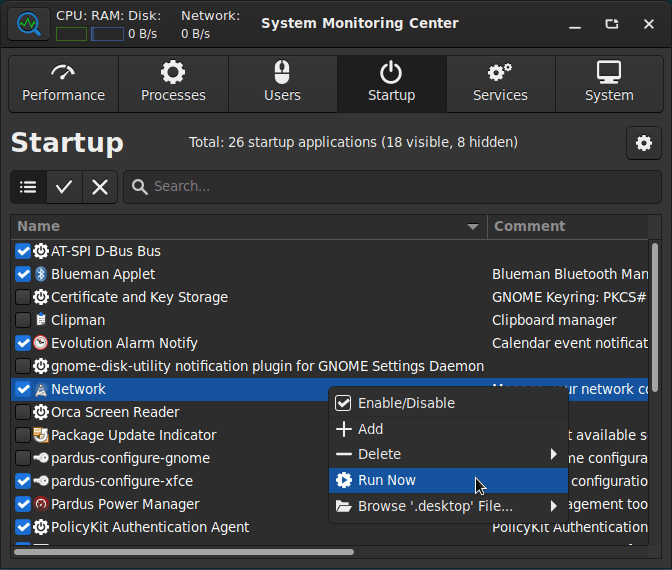

# System Monitoring Center

GTK3 and Python 3 based, system performance and usage monitoring tool.

### Installation:
- System Monitoring Center is installable from PyPI as a Python package.
- Option-1) Installing for current user account: `pip install system-monitoring-center`
- Option-2) Installing for system-wide: `sudo pip install system-monitoring-center`
    (This method can be used for preventing source code modifications.)
- First run:
    - Run the application by using `system-monitoring-center` command.
    - The application will prepare shortcut and GUI images automatically.
    - If command is not found, restart the system and run the command again.
    - If images are not shown on the GUI, run `touch ~/.local/share/*` or restart the system.

### Dependencies:
- These dependencies are already installed on many systems: `bash, dmidecode, iproute2, python3 (>=3.6), python3-cairo, python3-gi, python3-gi-cairo, udev, util-linux`
- Following dependencies may be required on some systems: for systems with .deb packages: `libcairo2-dev`, for Arch Linux: `polkit`

### Updating:
- Run one of these commands to update the application:
    - If the application is installed for current user account: `pip install --upgrade system-monitoring-center`
    - If the application is installed for system-wide: `sudo pip install --upgrade system-monitoring-center`

### Features:
- Detailed system performance and usage usage monitoring/managing features:
    - Monitoring CPU, RAM, Disk, Network, GPU hardware information/performance/usage
    - Monitoring and managing processes, startup applications and services (systemd)
    - Monitoring users, sensors and general system information
- Supports PolicyKit. No need to run the application with "sudo"
- Hardware selection options (selecting  different CPU cores, disks, network cards, GPUs)
- Plotting performance data of multiple devices at the same time
- Interactive charts for querying performance data on any point
- Option for showing processes as tree or list
- Language support:
    - Brazilian Portuguese, Czech, English, Polish, Turkish
    - More languages will be added if translations are provided by contributors
- Optimized for low CPU usage and fast start
- Shows notification if update is available on PyPI (disabled by default)
- Supports ARM architecture
- Adapts to system theme
- Free and open sourced

### Screenshots:

### Notes:
- GPU usage information availability depends on vendor/driver.
- GPU load is not tracked if GPU tab is switched off (for lower CPU usage).
- Some virtual machines does not provide CPU min-max frequencies, sensors and RAM hardware information.
