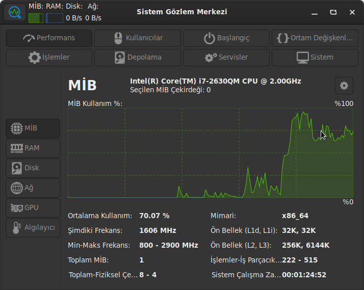
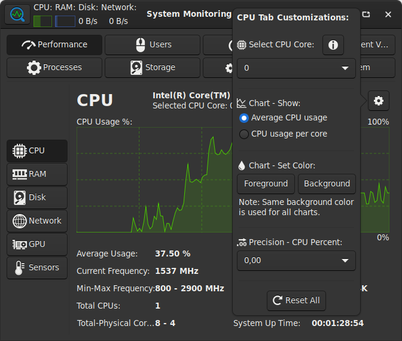
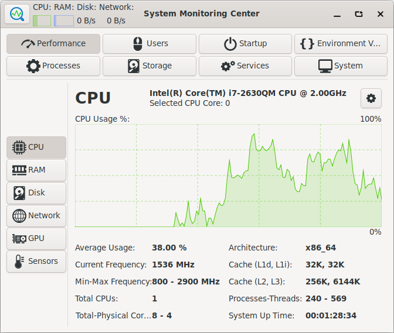
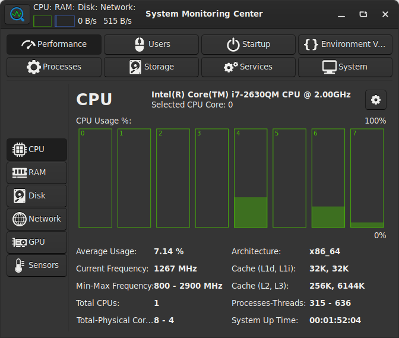
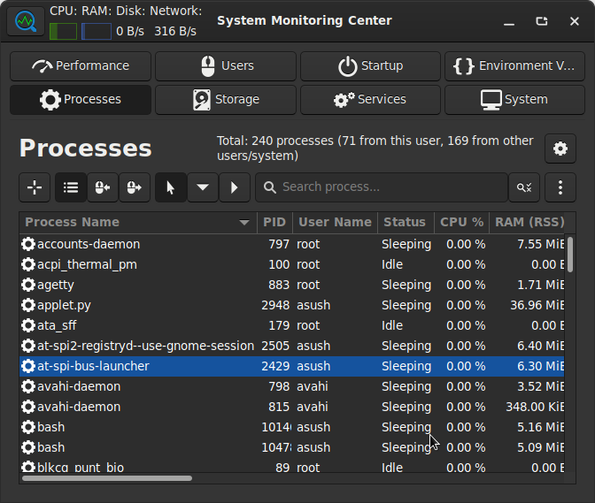
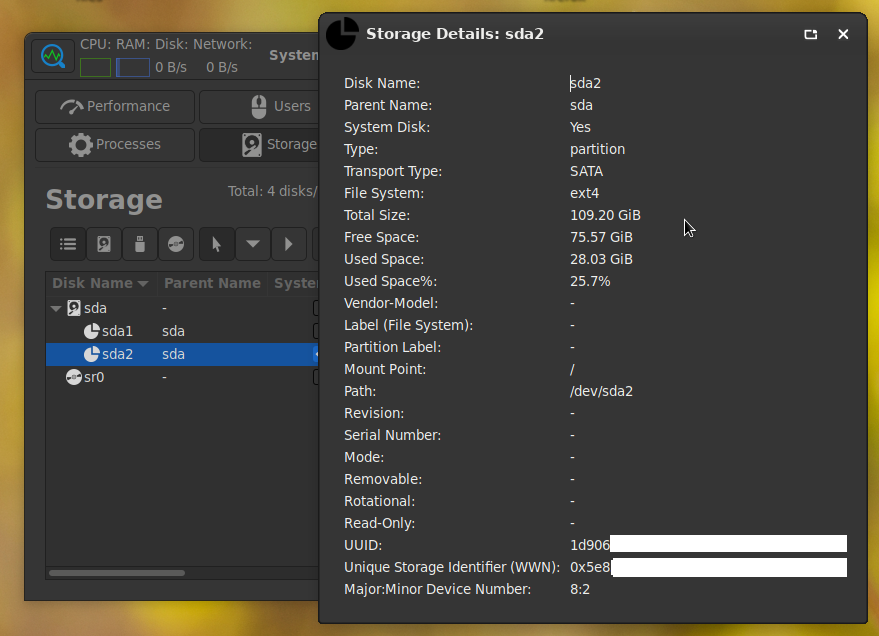

# System Monitoring Center

GTK3 and Python 3 based, system performance and usage monitoring tool.

### Features:
* Detailed system performance monitoring features
    * Monitoring CPU, RAM, Disk, Network, GPU, Sensor hardware information/performance/usage
    * An always on top and semi-transparent floating summary window for performance monitoring
    * Monitoring and managing processes
    * Viewing all human users (logged in/logged out) and monitoring per-user performance data
    * Monitoring and managing storage (non-removable, removable, optical/virtual disks, etc.)
    * Monitoring and managing startup applications (currently supports XFCE, GNOME, CINNAMON, MATE, KDE Plasma, GNOME-CLASSIC desktop environments)
    * Monitoring and managing system services (systemd services)
    * Monitoring and managing persistent environment variables and shell variables
    * Monitoring general system information (hardware/software)
* Application search and run with the following features:
    * Run in terminal
    * Run as root
    * Run with external GPU
* Functional/Visual customization options per-tab
* Advanced search options on Sensors, Processes, Users, Storage, Startup, Services, Environment Variables tabs
* Very low system resource usage while monitoring
* Language support (more languages will be added if translations are provided by contributors):
    * English
    * Turkish
* Provides help and additional information when mouse hover action is performed on several GUI objects
* Easy-to-use and multi-featured, compact GUI tool for system monitoring for:
    * Entry/Mid level computer users
    * Advanced level computer users for daily usage
* Adapts to system theme
* Free and open sourced

### Dependencies:
* Python 3.7 (Programming language)
* GTK 3.24 (GUI)
* python3-opengl (for FPS counting)

### Status:
 Under development, some features are not coded (very rare) and there may be bugs to be fixed.

Note: Developed on Pardus 21 XFCE (Debian-like GNU/Linux, Kernel: 5.10.0-8-amd64).
