# System Monitoring Center

<p align="center">
    
</p>


<p align="center">
    <strong>
        Multi-featured system monitor
    </strong>
</p>


<p align="center">
    <a href="https://github.com/hakandundar34coding/system-monitoring-center/tags">
        
    </a>
    <a href="https://github.com/hakandundar34coding/system-monitoring-center/tags">
        
    </a>
    <a href="https://github.com/hakandundar34coding/system-monitoring-center/tags">
        
    </a>
    <a href="https://pypi.org/project/system-monitoring-center/">
        
    </a>
    <a href="https://flathub.org/apps/details/io.github.hakandundar34coding.system-monitoring-center">
        
    </a>
    <a href="https://github.com/hakandundar34coding/system-monitoring-center/blob/master/Changes.md">
        
    </a>
</p>


<p align="center">
    <a href="https://github.com/hakandundar34coding/system-monitoring-center/tags">
        
    </a>
    <a href="https://github.com/hakandundar34coding/system-monitoring-center/tags">
        
    </a>
</p>


<p align="center">
    <strong>
        Translations:
    </strong>
    Chinese (Simplified) | Chinese (Traditional) | Czech | German | English | French | Hungarian | Persian | Polish | Portuguese (Brazilian) | Portuguese (Portugal) | Russian | Spanish | Turkish | <a href="docs/translations.md">Notes for translators</a>
</p>


<p align="center">
    <a href='https://flathub.org/apps/details/io.github.hakandundar34coding.system-monitoring-center'>
        
    </a>
    <a href='https://apps.pardus.org.tr/app/system-monitoring-center'>
        
    </a>
    <a href='https://github.com/Botspot/pi-apps'>
        
    </a>
</p>


<p align="center">
    <a href="https://repology.org/project/system-monitoring-center/versions">
        
    </a>
</p>
<p align="center">
    <a href="https://flathub.org/apps/details/io.github.hakandundar34coding.system-monitoring-center">
        
    </a>
    <a href="https://github.com/Botspot/pi-apps">
        
    </a>
</p>


### Features:
- Detailed system performance and usage usage monitoring/managing features:
    - Monitoring CPU, RAM, Disk, Network, GPU hardware/usage information
    - Monitoring and managing processes and services (systemd)
    - Monitoring users, sensors and general system information
- Supports PolicyKit. No need to run the application with "sudo"
- Hardware selection options (selecting CPU cores, disks, network cards, GPUs)
- Plotting performance data of multiple devices at the same time
- Interactive charts for querying performance data on any point
- Option for showing processes as tree or list
- Optimized for low CPU usage
- Customization menus for almost all tabs
- Supports ARM architecture
- Hardware accelerated GUI
- Free and open source


### Installation:
- There are several options for using System Monitoring Center:
    - Installing from Flatpak ([Details](docs/flatpak.md))
    - Installing from application stores (Pardus Application Center, Pi-Apps Store)
    - Installing from repositories of distributions
    - ~~Installing from PyPI as a Python package.~~ There will be no new packages on PyPI ([Details](docs/uninstall_pypi_package.md))
    - Running from source code:
      - For SMC v2: in ```src/``` folder, run: ```python3 ./run_from_source.py```
      - For SMC v1: in ```src/``` folder, run: ```python3 ./Main.py```


### Dependencies:
<details>
  <summary><ins>Show</ins></summary>

  ---
  #### Dependencies

  There is no need to install these dependencies for installing the application from Flatpak.
  For other installation types:

  - For System Monitoring Center v2.x.x:
      - `dmidecode, gir1.2-adw-1, gir1.2-glib-2.0, gir1.2-gtk-4.0, gir1.2-pango-1.0, hwdata, iproute2, python3 (>=3.6), python3-cairo, python3-gi, python3-gi-cairo, util-linux (>=2.31)`

  - For System Monitoring Center v1.x.x:
      - `dmidecode, hwdata, iproute2, procps (>=3.3), python3 (>=3.6), python3-cairo, python3-gi, python3-gi-cairo, util-linux (>=2.31)`

  - Following dependencies may be required on some systems:
      - `libcairo2-dev` (for systems with .deb packages)
      - `polkit` (for Arch Linux)

  - Optional dependencies:
      - `vcgencmd` (for physical RAM size, GPU frequency and video memory information on Raspberry Pi devices)
      - `x11-xserver-utils` or `xorg-xrandr` (for more accurate screen resolution and refresh rate detection of System Monitoring Center v1.x.x)
  ---

</details>


### Limitations and Known Issues:
<details>
  <summary><ins>Show</ins></summary>

  ---
  #### Limitations

  - GPU usage information availability depends on vendor/driver.
  - GPU load is not tracked if GPU tab is switched off (for lower CPU usage).
  - Virtual machines may not provide CPU min-max frequencies, sensors and RAM hardware information.
  - Non-Flatpak versions of the application has higher performance (start speed, CPU, RAM usage).
  - GTK4 (used for SMC v2) consumes about 2x RAM when compared to GTK3 (used for SMC v1).
  - Running SMC v1 after SMC v2 resets application settings

  #### Known Issues

  - Expander/Collapser arrows do not work sometimes if processes are listes as tree (Processes tab).
    <a href="https://github.com/hakandundar34coding/system-monitoring-center/issues/206">Issue</a>

  - Tab customization menus are not closed when clicked outside of the popover menu after using a dropdown menu on the popover menu.
      - This is a GTK4 bug. These menus can be closed by using `Esc` key.
  ---

</details>


### Screenshots:

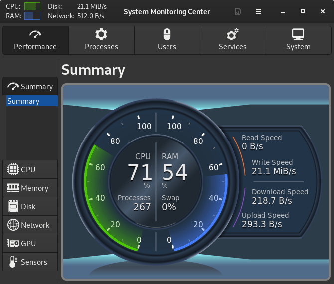

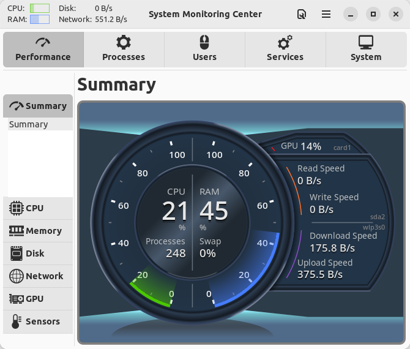

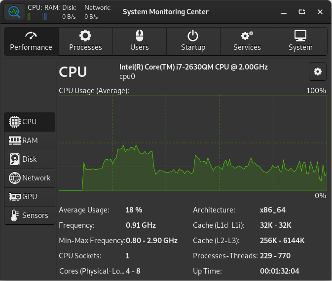

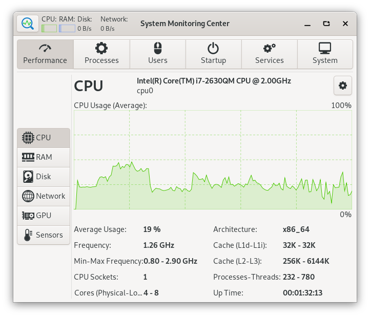

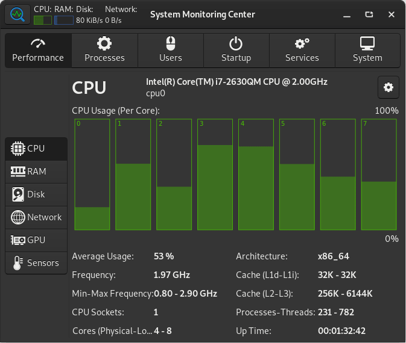

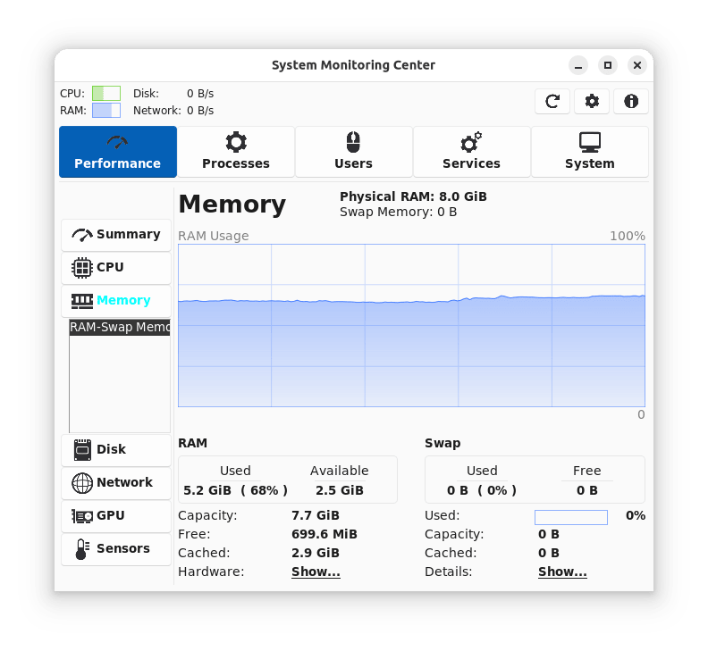


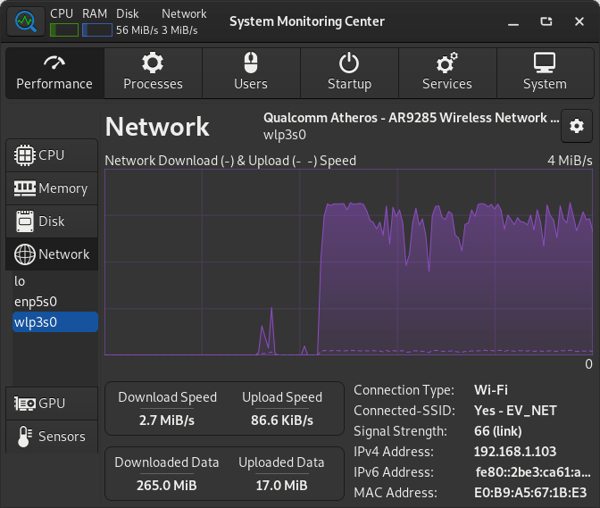

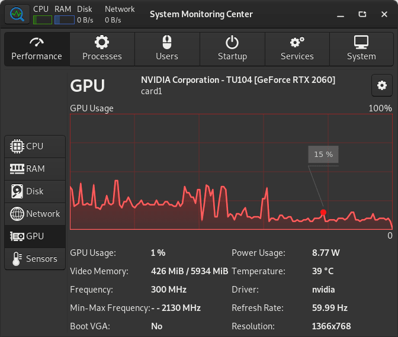

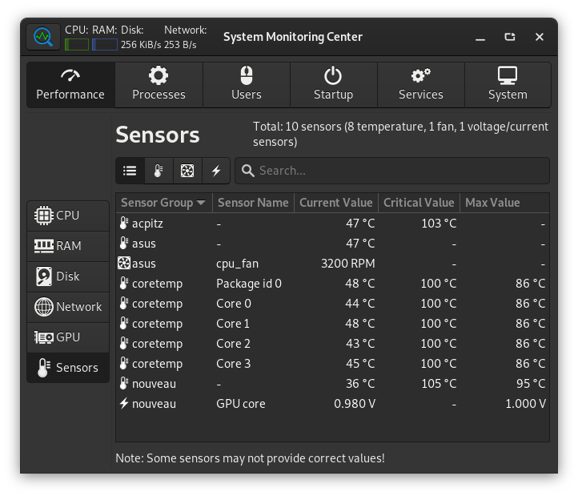

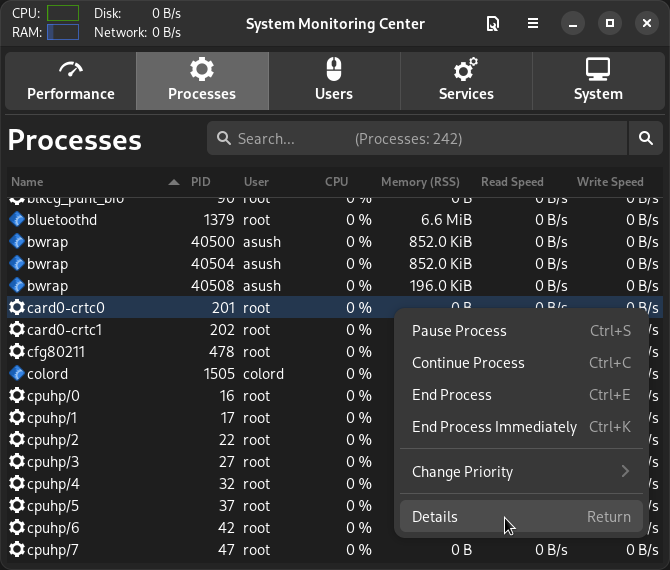

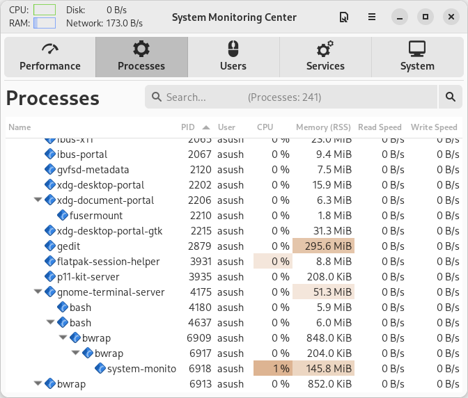

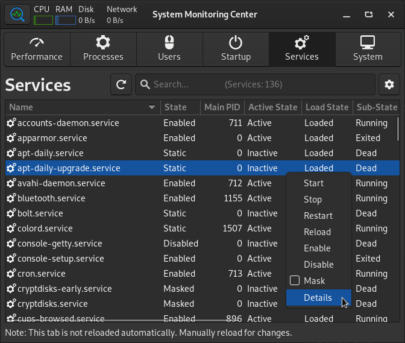

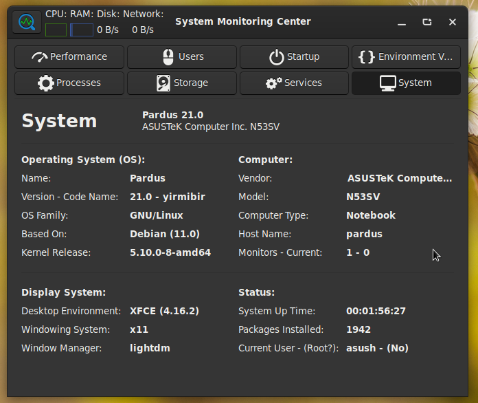


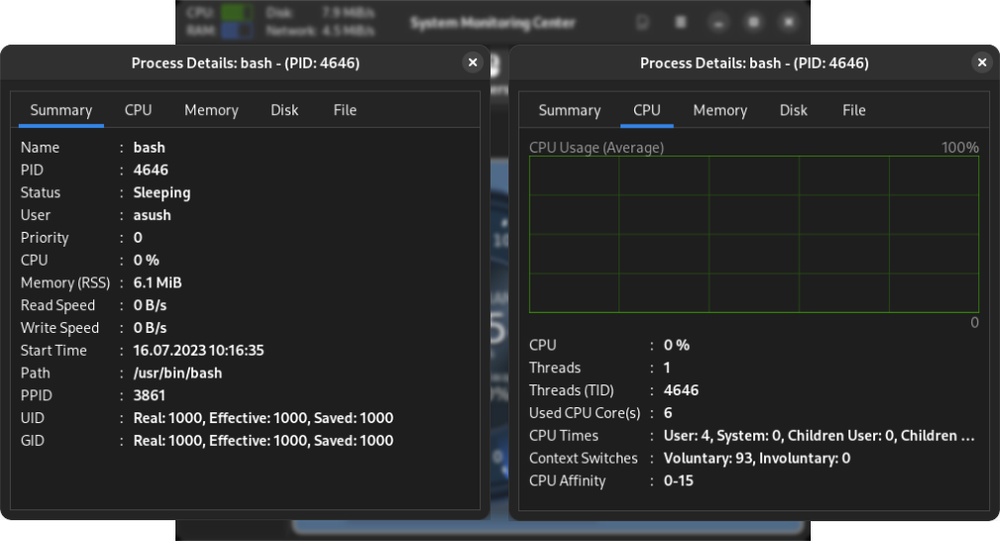

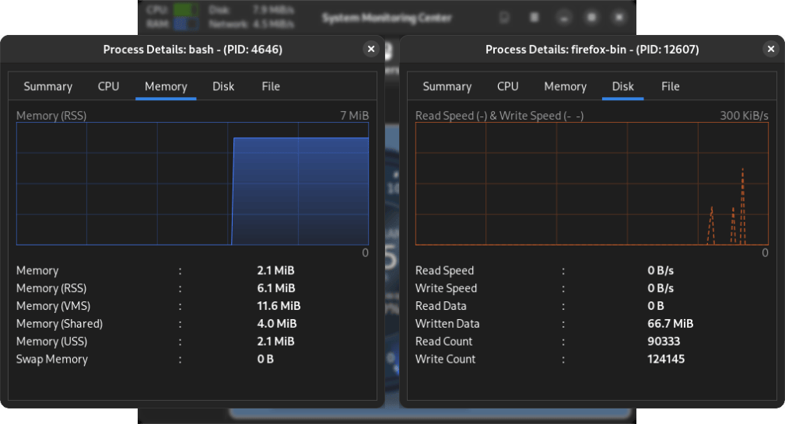

